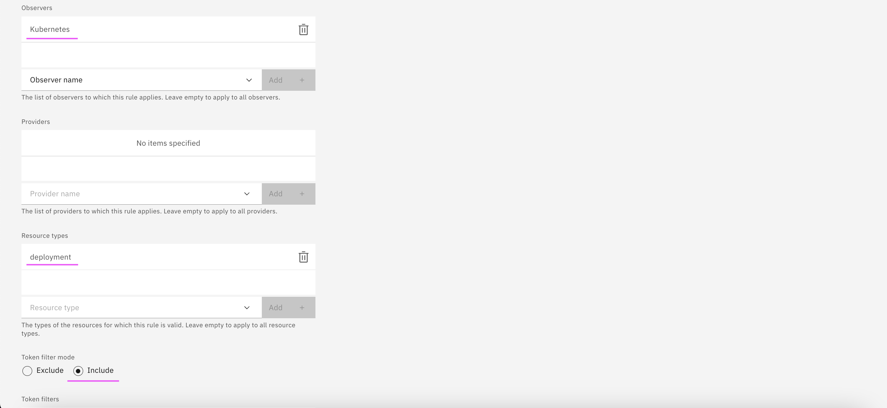

# Toplogy Merge Rules

This document gives insights about Topology merge rules.

The detailed documentation about defining merge rules is availabe in IBM documentation https://www.ibm.com/docs/en/cloud-paks/cloud-pak-watson-aiops/3.4.2?topic=elements-configuring-rules


## 1. Kube Observer

1. Two kube Observers are created for the same iLender application deployed on `ilender-ns` namespace.


2. Here is the topology of the `ilender-user` deployment


3. The 2 Resource groups got created with  `ilender-ns` namespace and 2 observers `ilender-dc1` and  `ilender-dc2`.


4. There are 2 resources with `ilender-user`. Each observer created one resource.


5. Comparing the `ilender-user` properties created by 2 obseervers,


## 2. Creating Merge Rules

1. Create a merge rule with the below condition. 
- Observer          : Kubernetes Observer 
- Resource          : `deployment`
- Merge Token value : `name`





2. Merge Rule Created


## 3. Viewing Results

The above merge rule prevents duplicate records of the same resource from being displayed in the topology. Now only one `ilender-user` would be displayed instead of 2.

1. Here you can see only one `ilender-user` is displayed. 


2. Comparing the `ilender-user` properties with and without merge rule,


i) `Merge Tokens` Created

```
"mergeTokens": [
    "ilender-user"
],
```

ii) `Vertex Type` becomes `composite` from `resource`

```
"vertexType": "composite"
```

iii) `_compositeOfIds` created by including the `_id` for the 2 ilender-user resources.

```
"_compositeOfIds": [
    "rnzVoA8hQNKiu_vsKEdMcQ",
    "JkblW3UlSue3P4lib1Ilag"
],
```

iv) `tags` contains data centers `cilender-dc1` and `cilender-dc2` of both observers.

```
"tags": [
    "app:ilender-application",
    "ilender-dc1",
    "ilender-dc2",
    "namespace:ilender-ns"
],
```